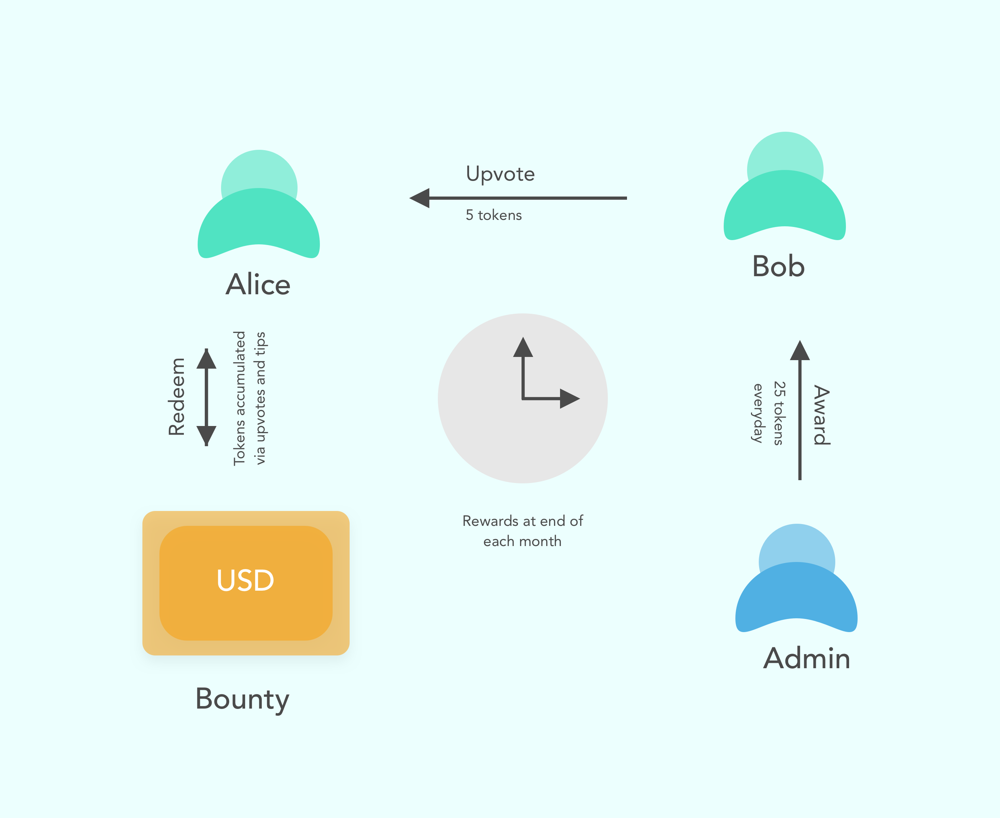

qEngage Bot Framework
=====================

Bot Framework for Driving Engagement in Groups. Written in Javascript

## Concept
The qEngage concept in detail is explained in [this](https://medium.com/qengage/qengage-core-features-and-concept-map-ce063ef1185f) medium post. Here is a short explanation

#### Summary
We’re essentially a community bot framework. Our pitch is that we enable and help brands make communities more engaging by allowing them to incentivise quality content creation and interaction. The way our framework works is best illustrated with the study of let’s say- a telegram group with 100 members. Let’s say these are members who post poems on the group.

The qEngage Concept

#### Core Functions
Once our bot is added to the group, it will serve the following functions.
1. Allow for tipping other users and content
2. Allow for redemption of tokens by users at a specified date
3. Allow admin of group to distribute tokens to users everyday
4. Allow admin to set an exchange value between tokens and real value, called the bounty. (can be USD)

The BOT also does two things. It deducts any unspent tokens from user’s accounts at the end of the day (from those that were awarded). And it allows for accumulation of tokens gained from the user’s content being up voted or the user being tipped.

## Interface
qEngage Bot Framework supports following commands:

### Commands that user can issue

- Commands that work in groups
* `/tip @user <amount>`  - tip a user with specified token amount
* `/upvote <amount>` - reply to any message in your chat. Tips the creator with specified amount.

- Commands that work in DMs
* `/balance` - this will show your current balance
* `/redeem <amount>` - to redeem tokens in exchange of bounty after specified date

### Commands that admin can issue

Admin commands can work only in DMs

* `/ban @user` - ban a user from receiving tokens hence forth
* `/unban @user` - unban a user from receiving tokens
* `/set_cycle <days>` - sets redemption cycle in number of days
* `/set_bounty <amount>` - set bounty for the specified period
* `/set_daily_award <amount>` - sets daily award to be given to users
* `/award @user <amount>` - awards specified user additional tokens
* `/deduct @user <amount>` - deduct tokens from specified user

## Planned features

- [] Additional user commands.
- [] Spec out different modules for platforms.
- [] Start implementation on telegram.

## Pricing and Support
 For pricing and support email tejnikumbh.competitions@gmail.com

 ## Author
 - Tejas Nikumbh
   - Email: tejnikumbh.competitions@gmail.com
   - Skype: tjnikumbh
